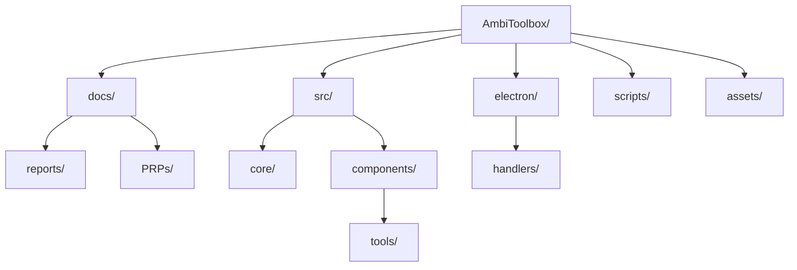

# Refactoring Recommendations: AmbiToolbox

## 1. Executive Summary
The AmbiToolbox project has grown into a sophisticated spatial audio suite, but several core components have become "God Scripts" that handle too many concerns. The repository root is also heavily cluttered with reports and temporary files, which obscures the primary project structure.

## 2. Repository Structural Scan
### Findings
*   **Root Clutter:** 37 files in the root, including numerous `*_REPORT.md`, `PROJECT_STATE.md`, and binary testing files (`test_000007.iamf`).
*   **Mixed Concerns:** `src/cpp` contains a mix of build artifacts (`build/`), vendor libraries (`vendor/`), and source code.
*   **Legacy Code:** `xCleanup` contains significant legacy logic that should be formally archived or deleted.

### Target Directory Structure

## 3. God Scripts & Component Modularity
### Highest Impact Targets
| File | Current Lines | Issue | Recommendation |
| :--- | :--- | :--- | :--- |
| `src/components/ToolViews.tsx` | 1,278 | God Component; contains multiple tool implementations and switcher logic. | Extract each tool into `src/components/tools/`, move file queue logic to a `useFileQueue` hook. |
| `electron/main.ts` | 613 | Main process bloat; handles Python spawning, cleanup, and IPC directly. | Modularize IPC handlers into the `electron/handlers/` directory. |
| `src/contexts/PlaybackContext.tsx`| 615 | Context Bloat; handles transport, volume, and routing. | Split into `TransportContext` and `AudioEngineContext`. |
| `electron/handlers/AmbiData.ts` | 491 | Large handler file; mixes FFmpeg/FFprobe logic with custom heuristics. | Split into `FfHandler`, `PythonHeuristics`, and `MetadataParser`. |

## 4. Logic and Dependency Analysis
*   **IPC Handlers:** Many handlers are defined inline in `electron/main.ts`. These should be moved to dedicated handler classes in `electron/handlers/`.
*   **Hardcoded Paths:** Several scripts reference paths relative to `__dirname` in ways that might break in production builds. Use a centralized `PathService`.
*   **DRY Violations:** Repetitive FFmpeg spawn logic across `AmbiData.ts` and `AmbiTrim.tsx`.

## 5. UI and Visual Boundaries
*   **Atomic Components:** Extract repetitive UI elements (bitrate selectors, order pickers) into shared components in `src/components/common/`.
*   **View vs Controller:** Many tool views mix layout logic with data transformations. Move transformations to utility functions or custom hooks.

## 6. Priority Roadmap
1.  **Critical (Next 1-2 Sprints):**
    *   Decompose `ToolViews.tsx` into atomic tool components.
    *   Modularize `electron/main.ts` using the existing `handlers/` pattern.
    *   Clean up the root directory by moving reports to `docs/reports/`.
2.  **High (Next 3-4 Sprints):**
    *   Refactor `PlaybackContext.tsx` to separate audio engine internals from UI state.
    *   Standardize FFmpeg interaction using a shared helper.
3.  **Nice to Have:**
    *   Formalize the `xCleanup` archival process.
    *   Clean up `src/cpp` to separate vendor code from project source.
